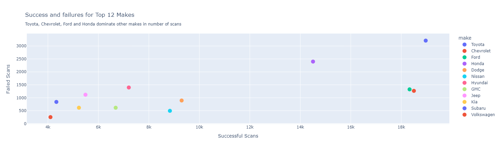
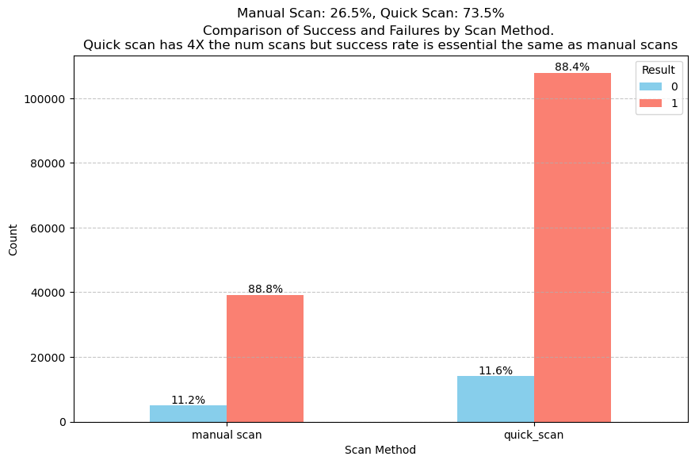

### **Executive Summary: Automotive Diagnostic Scantool Communication Analysis - PCMLAI Capstone Project**  
**Author:** Michael Nasers  

#### **Background**
A mobile application that performs vehicle diagnostics communicates via bluetooth to a vehicle communication interface (VCI) scantool. The scantool supports communications with a wide range of vehicles. A major problem with a scantool of this type is identifying communications gaps with the tool when only a small subset of vehicles are available for testing. As a result, the technical support team often struggles to diagnose issues remotely when customers call about scantool performance. A reliable method to predict whether a vehicle can be successfully scanned would allow support to focus on genuine vehicle issues, ultimately reducing average call times.

#### **Research Questions**  
The study analyzes vehicle communication telemetry data from an automotive diagnostics application to:  
- Assess overall success rates of communication attempts.  
- Identify most frequently scanned vehicle makes and models.  
- Detect scanning gaps and vehicles that the tool fail cannot communicate with.  
- Evaluate external factors affecting tool performance such as vehicle state.  
- Develop classification models to predict successful connections.  

#### Data Sources
The data source consists of telemetry data collected from a mobile vehicle diagnostics application and stored in Azure between October 1, 2024, and February 09, 2025. KQL queries are used to transform the JSON telemetry data into a tabular format. The image below illustrates this process.

  

**Data Preparation and merging:**
Event data is available for the past 90 days. The analysis combines two Excel files, each containing 90 days of vehicle connectivity data collected a month apart. The Jupyter notebook diag_usage_merging.ipynb merges these files, removes duplicates, and incorporates anonymized location data from a third file. Customer IDs are replaced with random IDs, with the mapping stored separately. Note: Original data files with customer information are not included in the repo.

  
 

**Data Cleaning:**
The Jupyter notebook **diag_usage_data_cleaning.ipynb** notebook is used to clean the data contained in the The **DiagUsagePowerBI_merged.xlsx** file. This file contains the results for 190,263 connection attempts between the ALLDATA scantool and various vehicles. After cleaning, 171,527 records remained. The cleaned data was saved to **DiagUsage_Cleaned.xlsx**. This file will be used for EDA and model training.

**Data Dictionary:**:

  <ul>
    <li><strong>siteId</strong>&nbsp;&nbsp;Anonymized customer Id for shop performing the scan</li>
    <li><strong>vin</strong>&nbsp;&nbsp;In addition to make, model, and year, the VIN encodes details on body style, engine type, and features to distinguish trim levels</li>
    <li><strong>year</strong>&nbsp;&nbsp;Production year of the vehicle for the scan tool connection attempt</li>
    <li><strong>make</strong>&nbsp;&nbsp;Manufacturer or brand of vehicle for the scan tool connection attempt</li>
    <li><strong>model</strong>&nbsp;&nbsp;Product line or design of vehicle for the scan tool connection attempt</li>
    <li><strong>system_category</strong>&nbsp;&nbsp;Represents the ECU (Electronic Control Unit), which is the endpoint of communications in the vehicle</li>
    <li><strong>veh_desc</strong>&nbsp;&nbsp;Concatenation of vehicles make, model and year. Used in visualizations</li>
    <li><strong>vci_version</strong>&nbsp;&nbsp;Software version level of the diagnostics scan tool at time of the scan</li>
    <li><strong>scan_method</strong>&nbsp;&nbsp;Connection method used for connection attempt (manual_scan or quick_scan)</li>
    <li><strong>batt_voltage</strong>&nbsp;&nbsp;Low battery voltage may be a cause of communications failures</li>
    <li><strong>product_type</strong>&nbsp;&nbsp;Customer type Repair or Collision</li>
    <li><strong>result</strong>&nbsp;&nbsp;0 - comm attempt failed. 1 - comm attempt was successful</li>
  </ul>

 

#### **Methodology**
Classification models, such as Logistic Regression, will be trained to predict the success of scantool communications with vehicle systems. The analysis will determine whether incorporating external features (such as vehicle battery voltage) enhances predictive performance, or if the intrinsic scantool features (make, model, year, system, VCI version) are sufficient to forecast communication success.

#### **Results**

#### **EDA Results**

 **Baseline Connection Success Rates**  

  

    The plot below show the overall scanning success rate accross all vehicle makes is 88%. This is baseline value for model comparsion. The plot also shows that domestic makes have the highest success scanning success rate. 
  

  

  

**Connection information by vehicle make** 

  

    The charts below show success and failure counts by make. The barchart is sorted by the highest failure count. While Toyota has the highest number of failures, it also had the highest number of successes. The scatter plot shows the top 12 makes by scan count. These 12 makes account for approximately 90% of scans. Out of the top 12 makes, Toyota, Chevy, Ford and Honda stand out in number of scans. Overall, European (81.5%) and Asian (87%) makes have a lower scanning success rate than domestic makes (92%).
  

  

    
  

  

    
  

**Enhanced powertrain dominates other systems in number of scans** 

  

    When connecting to a vehicle, the scantool will connect to the powertrain system by default if the user does not select a system. The powertrain system is also the most common vehicle system, so it was expected that the enhanced power train system would account for the majority of scans - but not to the extent of 95%. The plot below shows that the enhanced powertrain system not only comprises 95% of scans but also has the lowest failure rate, while several non-powertrain systems show higher failure rates. The reasons for these high failure rates remain unclear due to the low scan numbers and warrant further investigation.
  

  

    
  

**External factors did not affect connection success**

    Before analyzing the dataset, it was hypothesized that external factors (such as vehicle battery voltage and connection method) would influence scanning success rates. However, the plots below reveal that battery voltage distributions are nearly identical for both successful and failed connections, and success rates are similar across connection methods. These are unexpected findings and indicate these values may not be valuable when model training is performed.

   
   

  

  **Comparing Usage and Success Rates by Customer Type**
  The chart below displays the number of scans and connection success rates by customer type. Over the data collection period, 48% of scans were performed by collision shops, 46% by repair shops, and 5% by shops of unknown type. Although repair shops exhibit slightly higher connection success rates, collision shops performed nearly five times as many scans (122,648 versus 28,388). Overall, higher scan volumes correlate with improved success rates regardless of customer type.
  

    
  

  The chart below shows the distribution of the number of scans per customer. The distribution is right-skewed indicating that most customers use the service at lower levels, while a smaller number of customers use it much more frequently. Overall the mean number of scans per customer is 98 with a minimum number of scans being 1 and maximum number of scans 1486. 
  

    
  

  **Identifying vehicle systems with persistant scanning issues**

  

    The plot below illustrates the distribution of connection failures, grouped by vehicle description and target system. Overall, most vehicle systems achieve a high connection success rate. However, there is a distinct cluster at the 100% failure mark, which likely indicates the vehicle systems that the scantool is unable to communicate with.
  

  

    
  

  

    A total of 1587 unique VIN/system combinations were identified as having only connection failures across the dataset. Among these, 389 VINs experienced a single failure with no successful scans, while 1533 VINs failed at only one shop - these may or may not be scantool issues. 54 VINs exhibited failures at multiple shops, suggesting that these vehicle systems are consistently problematic across different locations. <strong>The vehicle system connection failures shown below should be addressed as soon as possible and will provide a hugh improvement in scantool success rates.</strong>   
  

  

    
  

  

#### **Model Results**

  

    Several classification models for predicting successful vehicle communications by a scantool were trained. All models had similar accuracy scores at around 89%–90% (the baseline success rate of the dataset was 88%). All models had excellent sensitivity at about 99%, ensuring reliable identification of successful scans. Precision and F1 scores were also high (94%–95%). Specificity was low for most models with the Random Forest ensemble model achieving the best specificity of 37%. The final models were effectively built using just five features (Make, Model, Year, System, and VCI_Version). Further analysis showed that up-to-date VCI software, scanning powertrain systems, and association with top vehicle makes as key predictors of scanning success. The plot below summarizes the performance for each model. 
  

  

    
  

  

    Below are the confusion matrix plots comparing the base Logistic Regression model with the Random Forest ensemble model, demonstrating that the ensemble approach delivers superior performance.
  

  

   
   
  

  

  Although the XGBoost model exhibited a noticeably higher NPR than the Random Forest model, the ROC curves below suggest that the Random Forest model is more effective for predicting scantool communications outcomes.
  

  

    
  

  

#### **Next steps and recommendations**

- **List persistently failing vehicle systems:**  
  Provide a list of vehicle systems with persistent failures at multiple shops to the diagnostic hardware supplier. Addressing communication issues with these vehicles would deliver the most value to the tool.

- **Force VCI software updates:**  
  Require customers with outdated VCI software versions to update to the latest version. Our EDA revealed that too many older versions of VCI software are still in use.

- **Prioritize scanning issues for popular vehicles:**  
  Share a list of the most scanned makes and models with the organization. Prioritize future potential scanning issues with these vehicles, as the top 12 vehicle makes account for 90% of scans.

- **Enhance telemetry data quality:**  
  Improve data quality by addressing errors discovered during data cleaning. For example, correctly handle multi-word make names (e.g., "Mercedes Benz") by adding a hyphen so the second word isn’t misinterpreted as the model name.

- **Investigate communication inconsistencies:**  
  Explore why some vehicle systems experience both high scanning success and failures. Extract additional vehicle details from the VIN—such as distinguishing between 2WD and 4WD—to improve prediction accuracy.

   **Investigate customer usage by location:**  
  Location data was acquired too late to be incorporated into this phase of the project. Future studies will explore how customer location influences vehicle scanning choices and whether it impacts scan success rates.

- **Build enhanced models:**  
  Develop new models using additional information extracted from the VIN to address the low specificity of the current classification models.

- **Deploy as a web-based service:**  
  Deploy the model as a web-based service accessible via an API or dashboard. This will enable technical support to quickly input vehicle details and receive real-time predictions about scantool success.

#### Outline of project
**README.md** - main file with summary of findings
**Images** - images used in the readme.md file

**Notebooks**
- **[diag_usage_merging.ipynb](notebooks/diag_usage_merging.ipynb)** – Merges multiple datasets and anonymizes data. **Note:** Original data sources used for merging contain customer information and are not included in the repo!
- **[diag_usage_data_cleaning.ipynb](notebooks/diag_usage_data_cleaning.ipynb)** – Cleans merged dataset and outputs data to be used for EDA
- **[diag_usage_eda.ipynb](notebooks/diag_usage_eda.ipynb)** – Performs exploratory data analysis on cleaned data to find patterns
- **[diag_usage_models.ipynb](notebooks/diag_usage_models.ipynb)** – Trains a variaty of classification models to predict connection success and evaluates their performance

**Datasets**
- Data/DiagUsagePowerBI_merged.xlsx - merged dataset output from diag_usage_merging.ipynb
- Data/DiagUsage_Cleaned.xlsx - cleaned dataset output from diag_usage_data_cleaning.ipynb. Used for EDA and model training

#### Contact and Further Information
### [Michael Nasers - LinkedIn Profile](https://www.linkedin.com/in/michael-nasers-34527728/)