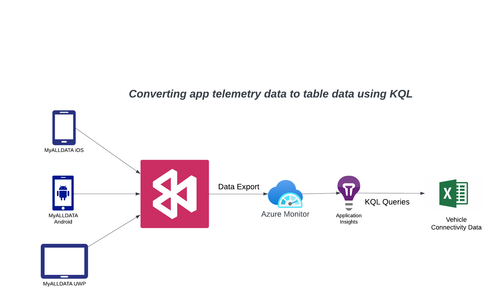
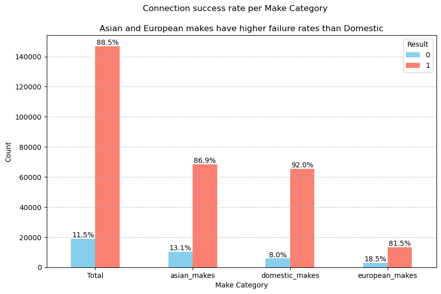
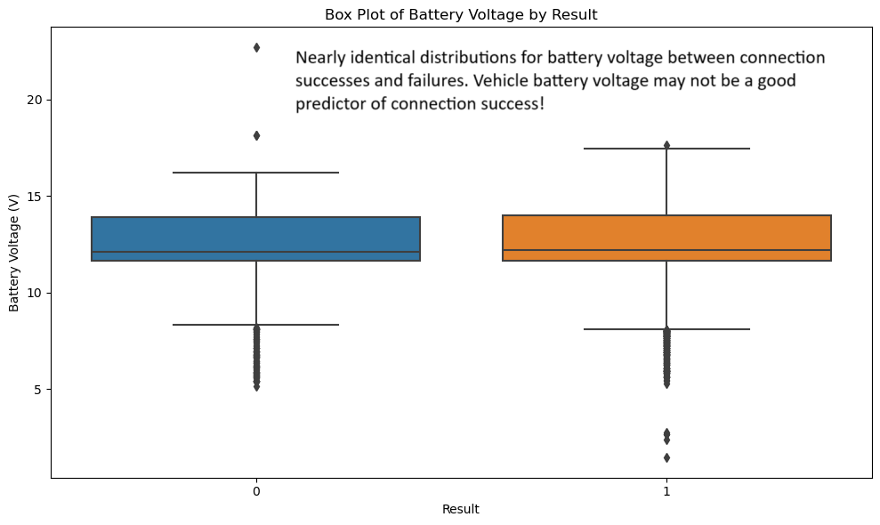

# Automotive Diagnostic Scantool Communication Analysis - PCMLAI Capstone
Repository containing the files for the PCMLAI course's Capstone project: 
### [link to public github repo containing code](https://github.com/mnazers734/pcmlai_capstone.git)

### Jupyter notebooks
<ul>
    <li><strong>diag_usage_merging.ipynb</strong>&nbsp;&nbsp;Merges multiple datasets and anonymizes data</li>
    <li><strong>diag_usage_data_cleaning.ipynb</strong>&nbsp;&nbsp;Cleans merged dataset and outputs data to be used for EDA</li>
    <li><strong>diag_usage_eda.ipynb</strong>&nbsp;&nbsp;Performs exploratory data analysis on cleaned data to find vehicle usage patterns</li>
    <li><strong>diag_usage_models.ipynb</strong>&nbsp;&nbsp;Performs feature engineering and modeling of connectivity data to predict connection success</li>
  </ul>

## Overview
### Research Question:
**What are the communication issues and gaps in vehicle coverage for the ALLDATA automotive diagnostic scantool, and how can these be identified and classified to improve diagnostic success rates and customer support efficiency?**
### Goals:

  <ul>
    <li>Use EDA and visualizations to identify overall success rate communicating with vehicles for the ALLDATA Diagnostics App</li>
    <li>Visualize most frequently scanned vehicle Makes and Models by ALLDATA customers</li>
    <li>Identify obvious scanning gaps, vehicles that the tool fails to communicate with, which can be shared with diagnostics hardware supplier</li>
    <li>Identify which external factors are affecting tool performance (such as a shops past scanning history)</li>
    <li>Use Classification Models to predict tools ability to connect to specific vehicles and systems</li>
  </ul>

 

### Background:
ALLDATA Diagnostics is a mobile app that offers comprehensive scan tool functionality for all vehicle makes and models. The app connects via Bluetooth to a Vehicle Communications Interface (VCI), which handles the actual communications with vehicles. Its primary users are independent aftermarket repair shops and collision centers. A key challenge for any comprehensive scan tool is determining which vehicles it cannot scan. When a scanning issue is reported, the problem may stem from vehicle-specific communication limitations, user errors, or faults in the scan tool itself.

## Data Sources
**Telemetry Data:**
Event data is currently collected from the ALLDATA Diagnostics mobile application and stored in Azure. KQL queries are used to convert the telemetry json data into a tabular format. The process is shown in the image below:

  

**Data Preparation and merging:**
Event data availability is limited to the previous 90 days. The data to be analyzed is a combination of two Excel files containing vehicle connectivity data collected approximately one month apart. Each file contains 90 days data. The Jupyter notebook **diag_usage_merging.ipynb** merges these files into a Dataframe and removes the duplicates. It then incorporates location data from a third Excel file containing customer information. The customer information in the merged Dataframe is anonymized by replacing the customer id with a random id. The mapping between the original id and random id is contained in the customer information Excel file. The merging process is shown in the diagram below. **Note: the orginal data files which contain customer information are not included in the repo**

  

 

**Data Cleaning:**
The Jupyter notebook **diag_usage_data_cleaning.ipynb** notebook is used to clean the data contained in the The **DiagUsagePowerBI_merged.xlsx** file. This file contains the results for 190,263 connection attempts between the ALLDATA scantool and various vehicles. After cleaning, 171,997 records remained. The cleaned data was saved to **DiagUsage_Cleaned.xlsx** A summary of cleaning activities is listed below:

  <ul>
    <li>Un-needed features such as 'billable status' were removed</li>
    <li>Missing battery voltage entries were replaced with value of zero. Invalid battery voltage entries were remove</li>
    <li>Multi-word vehicle make entries were combined to a single word (Mercedes Benz -> Mercedes-Benz)</li>
    <li>Invalid vehicle make entries were removed</li>
    <li>891 unique vehicle systems accross all makes were normalized into standard system category naming</li>
    <li>Vehicle scans using products 'demo mode' were removed</li>
  </ul>

  

**Relevant Features:**:

  <ul>
    <li><strong>siteId</strong>&nbsp;&nbsp;Anonymized customer Id for shop performing the scan</li>
    <li><strong>vin</strong>&nbsp;&nbsp;In addition to make, model, and year, the VIN encodes details on body style, engine type, and features to distinguish trim levels</li>
    <li><strong>year</strong>&nbsp;&nbsp;Production year of the vehicle for the scan tool connection attempt</li>
    <li><strong>make</strong>&nbsp;&nbsp;Manufacturer or brand of vehicle for the scan tool connection attempt</li>
    <li><strong>model</strong>&nbsp;&nbsp;Product line or design of vehicle for the scan tool connection attempt</li>
    <li><strong>system_category</strong>&nbsp;&nbsp;Represents the ECU (Electronic Control Unit), which is the endpoint of communications in the vehicle</li>
    <li><strong>veh_desc</strong>&nbsp;&nbsp;Concatenation of vehicles make, model and year. Used in visualizations</li>
    <li><strong>vci_version</strong>&nbsp;&nbsp;Software version level of the diagnostics scan tool at time of the scan</li>
    <li><strong>scan_method</strong>&nbsp;&nbsp;Connection method used for connection attempt (manual_scan or quick_scan)</li>
    <li><strong>batt_voltage</strong>&nbsp;&nbsp;Low battery voltage may be a cause of communications failures</li>
    <li><strong>product_type</strong>&nbsp;&nbsp;Customer type Repair or Collision</li>
    <li><strong>result</strong>&nbsp;&nbsp;0 - comm attempt failed. 1 - comm attempt was successful</li>
  </ul>

 

## EDA
### Initial Observations of the Data
#### VCI Software Versions
The VCI (Vehicle Communications Interface) is the hardware device that communicates with the vehicle. The ALLDATA mobile application communicates with the VCI via bluetooth.Initial examination of the vehicle connectivity dataset showed that a very high number of older VCI software versions **24** are still being used by customers. Some of these software versions are several years old! The table below shows that seven VCI software versions make up almost 97% of scans. These will be kept and records using the remaining software versions will be removed. 
**Note:** Even older versions of VCI software have similar connection success rates

<table border="1" class="dataframe">
  <caption style="caption-side: bottom;">VCI Version Information Success Rates</caption>
  <thead>
    <tr style="text-align: right;">
      <th>result</th>
      <th>0</th>
      <th>1</th>
      <th>total</th>
      <th>percentage</th>
      <th>success rate</th>
      <th>cumulative_percentage</th>
    </tr>
    <tr>
      <th>vci_version</th>
      <th></th>
      <th></th>
      <th></th>
      <th></th>
      <th></th>
      <th></th>
    </tr>
  </thead>
  <tbody>
    <tr>
      <th>22.3.2439.2</th>
      <td>10049</td>
      <td>73322</td>
      <td>83371</td>
      <td>48.472357</td>
      <td>87.946648</td>
      <td>48.472357</td>
    </tr>
    <tr>
      <th>22.1.2418.1</th>
      <td>5490</td>
      <td>41518</td>
      <td>47008</td>
      <td>27.330709</td>
      <td>88.321137</td>
      <td>75.803066</td>
    </tr>
    <tr>
      <th>22.1.2411.1</th>
      <td>919</td>
      <td>8784</td>
      <td>9703</td>
      <td>5.641377</td>
      <td>90.528702</td>
      <td>81.444444</td>
    </tr>
    <tr>
      <th>21.3.2337.1</th>
      <td>1133</td>
      <td>8013</td>
      <td>9146</td>
      <td>5.317535</td>
      <td>87.612071</td>
      <td>86.761978</td>
    </tr>
    <tr>
      <th>21.2.2323.1</th>
      <td>659</td>
      <td>6394</td>
      <td>7053</td>
      <td>4.100653</td>
      <td>90.656458</td>
      <td>90.862631</td>
    </tr>
    <tr>
      <th>21.0.2307.1</th>
      <td>654</td>
      <td>5552</td>
      <td>6206</td>
      <td>3.608202</td>
      <td>89.461811</td>
      <td>94.470834</td>
    </tr>
    <tr>
      <th>22.2.2424.1</th>
      <td>464</td>
      <td>3748</td>
      <td>4212</td>
      <td>2.448880</td>
      <td>88.983856</td>
      <td>96.919714</td>
    </tr>
    <tr>
      <th>20.3.2237.1</th>
      <td>188</td>
      <td>1660</td>
      <td>1848</td>
      <td>1.074437</td>
      <td>89.826840</td>
      <td>97.994151</td>
    </tr>
    <tr>
      <th>20.0.2150.1</th>
      <td>111</td>
      <td>836</td>
      <td>947</td>
      <td>0.550591</td>
      <td>88.278775</td>
      <td>98.544742</td>
    </tr>
    <tr>
      <th>19.2.2125.1</th>
      <td>66</td>
      <td>368</td>
      <td>434</td>
      <td>0.252330</td>
      <td>84.792627</td>
      <td>98.797072</td>
    </tr>
    <tr>
      <th>20.2.2223.1</th>
      <td>48</td>
      <td>371</td>
      <td>419</td>
      <td>0.243609</td>
      <td>88.544153</td>
      <td>99.040681</td>
    </tr>
    <tr>
      <th>19.2.2133.1</th>
      <td>40</td>
      <td>370</td>
      <td>410</td>
      <td>0.238376</td>
      <td>90.243902</td>
      <td>99.279057</td>
    </tr>
    <tr>
      <th>19.0.2105.3</th>
      <td>18</td>
      <td>276</td>
      <td>294</td>
      <td>0.170933</td>
      <td>93.877551</td>
      <td>99.449990</td>
    </tr>
    <tr>
      <th>20.2.2226.1</th>
      <td>38</td>
      <td>248</td>
      <td>286</td>
      <td>0.166282</td>
      <td>86.713287</td>
      <td>99.616272</td>
    </tr>
    <tr>
      <th>18.1.22</th>
      <td>53</td>
      <td>231</td>
      <td>284</td>
      <td>0.165119</td>
      <td>81.338028</td>
      <td>99.781392</td>
    </tr>
    <tr>
      <th>21.2.2323.2</th>
      <td>15</td>
      <td>108</td>
      <td>123</td>
      <td>0.071513</td>
      <td>87.804878</td>
      <td>99.852904</td>
    </tr>
    <tr>
      <th>17.1.1.4</th>
      <td>21</td>
      <td>80</td>
      <td>101</td>
      <td>0.058722</td>
      <td>79.207921</td>
      <td>99.911626</td>
    </tr>
    <tr>
      <th>17.2.1.2</th>
      <td>9</td>
      <td>39</td>
      <td>48</td>
      <td>0.027907</td>
      <td>81.250000</td>
      <td>99.939534</td>
    </tr>
    <tr>
      <th>22.2.2431.1</th>
      <td>2</td>
      <td>40</td>
      <td>42</td>
      <td>0.024419</td>
      <td>95.238095</td>
      <td>99.963953</td>
    </tr>
    <tr>
      <th>17.3.0.3</th>
      <td>8</td>
      <td>25</td>
      <td>33</td>
      <td>0.019186</td>
      <td>75.757576</td>
      <td>99.983139</td>
    </tr>
    <tr>
      <th>18.3.43.1</th>
      <td>0</td>
      <td>13</td>
      <td>13</td>
      <td>0.007558</td>
      <td>100.000000</td>
      <td>99.990698</td>
    </tr>
    <tr>
      <th>17.0.3.3</th>
      <td>0</td>
      <td>10</td>
      <td>10</td>
      <td>0.005814</td>
      <td>100.000000</td>
      <td>99.996512</td>
    </tr>
    <tr>
      <th>20.3.2242.1</th>
      <td>0</td>
      <td>4</td>
      <td>4</td>
      <td>0.002326</td>
      <td>100.000000</td>
      <td>99.998837</td>
    </tr>
    <tr>
      <th>16.0.1</th>
      <td>0</td>
      <td>2</td>
      <td>2</td>
      <td>0.001163</td>
      <td>100.000000</td>
      <td>100.000000</td>
    </tr>
  </tbody>
</table>

#### Vehicle Model Years
Even though it may scan older vehicles, the ALLDATA diagnostics tool officially only supports vehicles with model year of 2000 or newer. There are only a small percentage of vehicle scans pre model year 2000 so they will be removed.
#### Summary of vehicle and customer features in the dataset. 
After removing records for older VCI software versions and model years there were **165,215** records remaining 
<table>
  <thead>
    <tr>
      <th>Feature</th>
      <th>Count</th>
      <th>Description</th>
    </tr>
  </thead>
  <tbody>
    <tr>
      <td>siteId</td>
      <td>1830</td>
      <td>Total number of unique shops performing at least one scan</td>
    </tr>
    <tr>
      <td>vin</td>
      <td>61808</td>
      <td>VIN contains highest concentration of vehicle information and identifies number of unique vehicle variants in dataset</td>
    </tr>
    <tr>
      <td>year</td>
      <td>26</td>
      <td>Unique years</td>
    </tr>
    <tr>
      <td>make</td>
      <td>46</td>
      <td>Unique makes</td>
    </tr>
    <tr>
      <td>model</td>
      <td>594</td>
      <td>Unique Models across all Makes</td>
    </tr>
    <tr>
      <td>system</td>
      <td>886</td>
      <td>Number of unique systems divided into 26 normalized system categories</td>
    </tr>
    <tr>
      <td>veh_desc</td>
      <td>4908</td>
      <td>Number of unique Make, Model, Year combinations</td>
    </tr>
    <tr>
      <td>vci_version</td>
      <td><strong>7</strong></td>
      <td>Number of different VCI software versions - reduced from 24</td>
    </tr>
    <tr>
      <td>state</td>
      <td>65</td>
      <td>Shop location - includes Canadian territories</td>
    </tr>
    <tr>
      <td>vin/systems</td>
      <td>65358</td>
      <td>Unique VIN / System combinations. The system represents a physical ECU on the vehicle</td>
    </tr>
    <tr>
      <td>veh_desc/systems</td>
      <td>8573</td>
      <td>Unique vehicle description and system combinations. The system represents a physical ECU on the vehicle</td>
    </tr>
  </tbody>
</table>

### Examining Vehicle Connection Success Rates. 
**Overall Connection Success Rates**

  

    The ALLDATA diagnostics product supports two connection methods, Manual Scan and Quick Scan. When Quick Scan mode is selected, the tool will attempt to automatically determine a vehicle's attributes by sending various diagnostic messages on the vehicle’s communications bus. When using Manual Scan mode, the user selects vehicle options from drop down menus. It was assumed that Manual Scan mode would be more reliable and produce a higher success rate for communications. However, the bar chart below shows almost identical success rates for both connection methods.
  

  

**Connection Success Rates Based on Connection Type**

  

    The ALLDATA diagnostics product supports two connection methods, Manual Scan and Quick Scan. When Quick Scan mode is selected, the tool will attempt to automatically determine a vehicle's attributes by sending various diagnostic messages on the vehicle’s communications bus. When using Manual Scan mode, the user selects vehicle options from drop down menus. It was assumed that Manual Scan mode would be more reliable and produce a higher success rate for communications. However, the bar chart below shows almost identical success rates for both connection methods.
  

  

    
    
  

  

    
  

**Battery Voltage:**

  

    Before analyzing the vehicle connectivity dataset, it was assumed that low battery voltages could be a source of vehicle connection failures. However, the boxplots below show that the battery voltage distributions are nearly identical for connection successes and failures. Vehicle battery voltage may not be a good predictor of connectivity success. 
  

  

    
  

  

### Exploratory Analysis of Vehicle Characteristics

  

    The plot below show the distribution of connection attempts per vehicle model year. The plot shows a roughly normal distribution with two peaks around model years 2020 and 2015. This result is actually expected because of the differences in vehicles scanned by Repair shops and Collision shops. Collision shops scan newer vehicles while Repair shops normally scan vehicles 7-10 years old. 
  

  

    
  
    

  

    The following two plots show the vehicle connection success and failure counts for connection attempts to different vehicle Makes. From the above plots it can been that Makes Toyota, Chevrolet, Ford and Honda are by far have the highest number of successful scans. Toyota and Honda also stand out as having a very high number of failed scans
  

  

    
  

  

    
  

  

    From the above plots it can been that Makes Toyota, Chevrolet, Ford and Honda by far have the highest number of successful scans. Toyota and Honda also stand out as having a very high number of failed scans. Subsets of the dataset were create for different vehicle categories (Domestic, Asian, European, Specialty) and their success / failure rates were plotted. The bar plot below clearly shows higher failure rates for Asian and European makes
  

  

    
  

### Examining connection success rates for two vehicle and system groupings. 

  

    When connecting to a vehicle, a physical ECU (system) is the endpoint of communications. The combinations of vin and system and veh_desc and system were compared.  <strong>Note:</strong> A VIN provides detailed, granular information about a vehicle, which means that different VINs may correspond to the same overall vehicle description.
  

  

  
  

  
  

  

       
      <table>
        <caption><strong>Comparative Statistics of Connection Success Rates from Multiple Grouping Combinations</strong></caption>
        <thead>
          <tr>
            <th>Grouping</th>
            <th>Count</th>
            <th>mean</th>
            <th>std</th>
            <th>median</th>
            <th>min num scans</th>
            <th>max num scans</th>
          </tr>
        </thead>
        <tbody>
          <tr>
            <td>All Samples</td>
            <td>165,218</td>
            <td>89%</td>
            <td>32</td>
            <td>100</td>
            <td>NA</td>
            <td>NA</td>
          </tr>
          <tr>
            <td>Vehicle Description System combination</td>
            <td>8573</td>
            <td>79.31%</td>
            <td>36.39</td>
            <td>100</td>
            <td>1</td>
            <td>710</td>
          </tr>
          <tr>
            <td>VIN System Combination</td>
            <td>65,358</td>
            <td>92.38%</td>
            <td>23.9</td>
            <td>100</td>
            <td>1</td>
            <td>41</td>
          </tr>
        </tbody>
      </table>
  

  

    Vehicle descriptions aggregate multiple variants, so if any variant has communication issues, the overall success rate drops. This leads to a lower mean and higher standard deviation for the vehicle description grouping compared to the more consistent VIN grouping. The median of 100 across all groups indicates that while most vehicles can be scanned successfully, some problematic variants are impacting the averages.
  

### Failures at multiple shops with no successes are considered to be tool issues!

  

    A dataframe consisting of samples for vehicle VINs which only had failed scans was obtained from the dataset containing all samples. For each of these VINs, there were no successful scans. VINs that appeared at a single customer shop were removed because there is not enough information to assume if the vehicle can be scanned. Failures at multiple shops with no successes are considered to be tool issues. 

  

    
  

  

## EDA  Results and Recommendations
1. **Baseline scanning success rates were identified:**  
   - The ALLDATA diagnostics scantool achieved an overall scanning success rate of 89%, which is better than expected, yet still leaves room for improvement. Additionally, when success rates and scan frequencies were analyzed by vehicle make, Toyota and Honda emerged as high priorities for further investigation. Although their success rates are relatively high compared to Volvo's very low rate, the high scan volumes for Toyota and Honda indicate they are key customer segments that warrant additional focus.  

2. **List of vehicles and systems not supported by the scantool were identified:**  
   - A set of vehicle systems (ECUs) that are highly likely to be unsupported by the ALLDATA VCI was identified. This was determined by querying the dataset for VIN and system combinations that consistently resulted in scan failures across multiple shops, with no successful scans recorded.
   - The list of vehicles, which we are confident of being unsupported, enables our VCI hardware supplier to focus solely on the cases that provide the most value to improving the tool without the need to debug all vehicles with communication failures.

3. **Vehicle Battery Voltage does not appear to be a predictor of scanning success or failure:**  
   - It was originally hypothesized that low battery voltage might contribute to vehicle communication failures, especially in cases of intermittent issues. However, after analyzing battery voltage statistics for both failed and successful scans and evaluating the baseline model’s performance, the data suggests that battery voltage is not a significant predictor of communication success.

4. **Scan type does not affect overall scanning success rate but maybe usefull in some situations:**  
   - It was expected that out of the two scanning methods, Quick Scan and Manual Scan, Quick Scan would have a lower success rate because it relies on the tool to make vehicle selections based on interpreting data returned from the vehicle. Also, because of the way some OEMs organize their diagnostic data, the Quick Scan process can cause problems. 

5. **Too many customers are using out of date VCI software:**  
   - Only 48% of communication attempts in the dataset were made using the latest version of VCI Software. Although overall scanning success rates were maintained—provided users had updated within the past two years—using outdated software could miss fixes for known issues and allow regressions to go undetected. An action item will be suggested to force the user to update their VCI software if it is more than 3 versions out of date. 

6. **The information needed to accurately predict communications failures may be contained within the VIN:**  
   - Data were grouped in two ways to analyze scanning success rates: one by Year/Make/Model/System and another by VIN/System. The VIN/System grouping is more granular, containing 65,358 samples compared to 8,573 in the Year/Make/Model/System grouping. It also shows a higher average success rate with lower variability, suggesting that individual differences at the VIN level can lower the aggregated success rate when grouped by broader vehicle characteristics. In the future, we plan to parse VINs during pre-processing using a third-party API to add more detailed vehicle features—such as drivetrain, transmission type, body type, and trim level.
  
7. **Enhanced Powertrain dominates system connections:**  
   - 95% of vehicle connections target the Enhanced Powertrain System. This is expected since the tool defaults to Enhanced Powertrain if no selection is made, and it is also the most commonly diagnosed system overall. However, the fact that such a high percentage of connections are directed to Enhanced Powertrain is still surprising. Additionally, scans targeting systems other than Enhanced Powertrain exhibit a significantly higher failure rate than the baseline. Further investigation is needed to determine whether this discrepancy is due to VCI hardware issues, user error, or the tool’s selection process for non-Enhanced Powertrain systems.

## ML Modeling 
### Baseline Models

  

    Baseline Logistic Regression models were created using the <strong>diag_usage_models.ipynb</strong> notebook with the <strong>DiagUsage_Cleaned.xlsx</strong> dataset.  
    The baseline Logistic Regression model was trained using the following features: <strong>year, make, model, system, scan_method</strong>. The data frame used for this model had 165,218 samples. A second model was trained also considering <strong>batt_voltage</strong>. This dataset had 126,646 samples. As discussed during EDA, the reduced number of samples was due to the fact that battery voltage was only recently added to the telemetry data from the mobile app.      
    The above model training was repeated after performing feature engineerig on the datasets above to reduce the dimensionality of the 'model' and 'system' features. 
    The initial dataset had 594 unique model names for the model feature. 95 of these models account for over 80 percent of samples. The top 95 models were retained and the remaining model names were mapped to the 'other' category. 
    Because, 95 percent of the samples in the datasets had the value of 'Enhanced Powertrain', it was decided to map all systems to the 'other' category except for the top 3 systems, 'Enhanced Powertrain', 'Braking System' and 'Airbag Control System'. 
    The table below shows the results of the four baseline models. 
  

  
  

    <table>
  <caption>Comparison of performance for Logistic Regression models on Diagnostic Usage dataset</caption>
  <thead>
    <tr>
      <th>metric</th>
      <th>Base Logistic Regression Model %</th>
      <th>Base Model w/Batt Voltage %</th>
      <th>Base Model 80 percent of models %</th>
      <th>Base Model 80 percent of models % w/Batt Voltage</th>
    </tr>
  </thead>
  <tbody>
    <tr>
      <td>Score</td>
      <td>89.21</td>
      <td>89.06</td>
      <td>89.03</td>
      <td>89.06</td>
    </tr>
    <tr>
      <td>accuracy</td>
      <td>89.27</td>
      <td>89.21</td>
      <td>89</td>
      <td>89.02</td>
    </tr>
    <tr>
      <td>sensitivity (recall)</td>
      <td>99.38</td>
      <td>99.48</td>
      <td>99.47</td>
      <td>99.61</td>
    </tr>
    <tr>
      <td>specificity</td>
      <td>10.97</td>
      <td>10.09</td>
      <td>7.88</td>
      <td>7.48</td>
    </tr>
    <tr>
      <td>precision</td>
      <td>89.64</td>
      <td>89.50</td>
      <td>89.32</td>
      <td>89.24</td>
    </tr>
    <tr>
      <td>F1_Score</td>
      <td>94.26</td>
      <td>94.23</td>
      <td>94.12</td>
      <td>94.14</td>
    </tr>
    <tr>
      <td>negative predictive value</td>
      <td>69.52</td>
      <td>71.40</td>
      <td>65.61</td>
      <td>71.20</td>
    </tr>
  </tbody>
</table>

#### Baseline model performance

  

  All baseline models had around 89% for both the overall score and accuracy, indicating that they perform almost identically on this metric. Sensitivity was exceptionally high in every model (99.38% to 99.61%) showing the all models are excellent at correctly identifying positive cases. The model variations have only marginal differences here. All of the models specificity is quite low (7.5% and 11%) for all models suggesting that none of the models are effective at identifying negative cases. The overall F1 scores are in the mid-94% range which is higher than expected for a baseline model. The model trained which included battery voltage had only marginally better performance. The models trained with reduced features did not have improved results. The baseline model would be very good at predicting if the ALLDATA diagnostics tool would be able to successful communicate with a particular vehicle but any negative predictions would need to be investigated further. Future model refinements will be aimed at balancing these results. 
  

